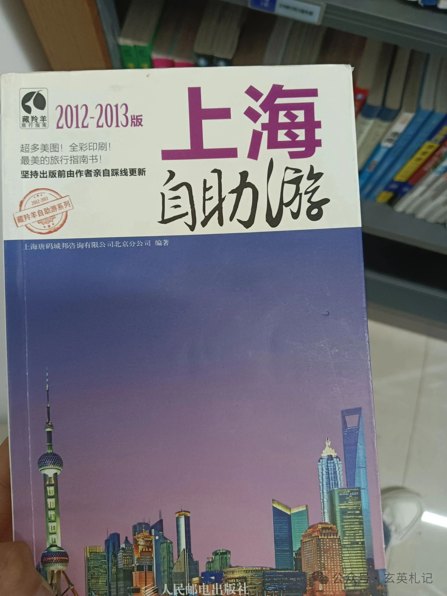
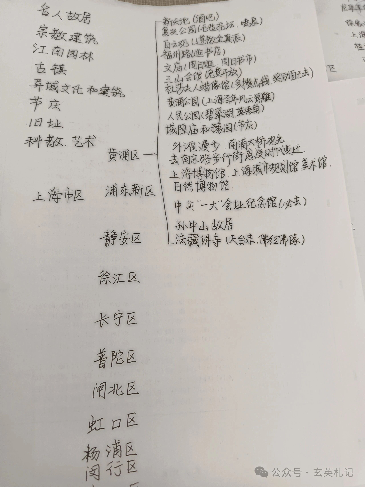
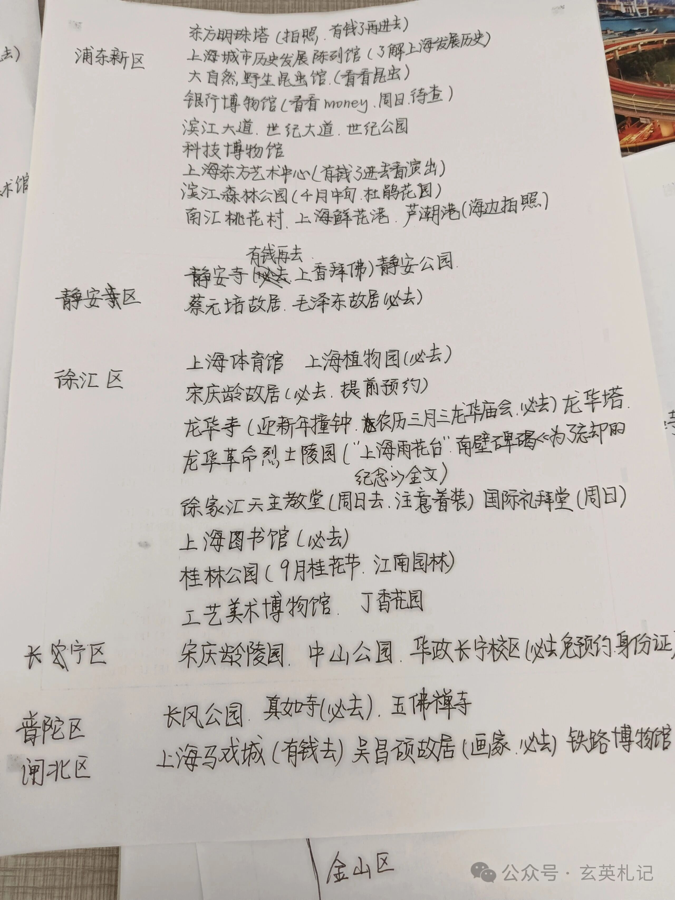
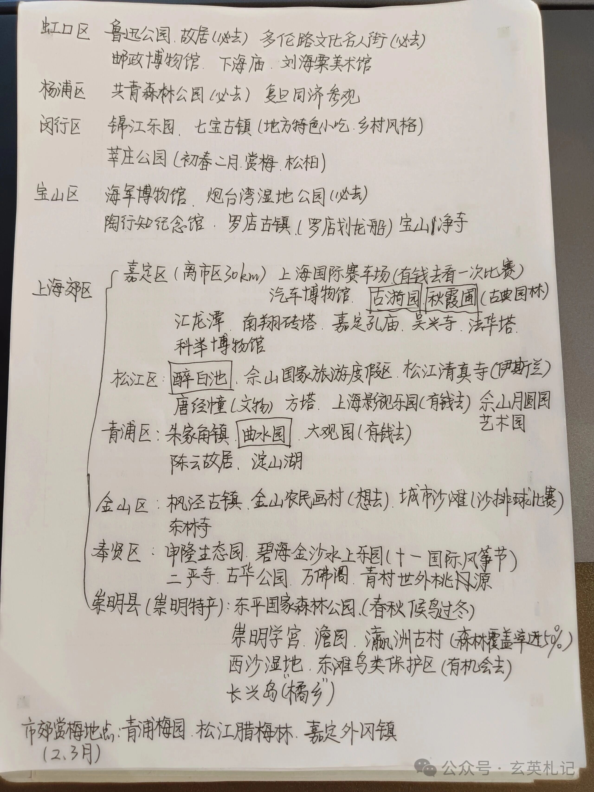
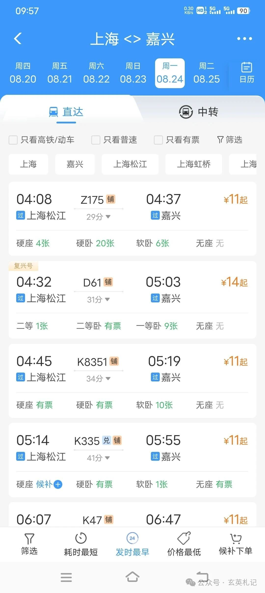
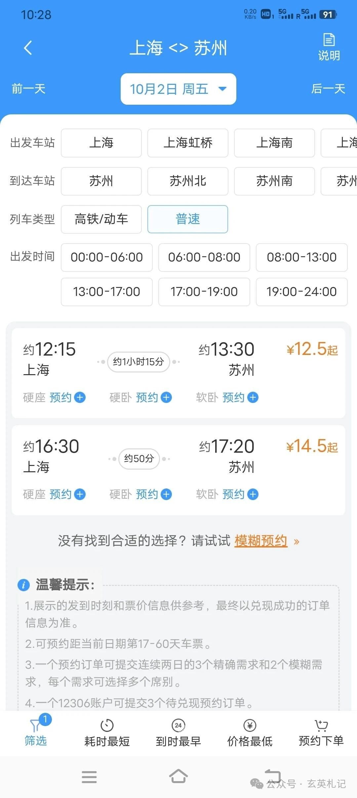

脚步暂时到达不了的地方，书籍可以。

这本《上海自助游》虽然是13年的书了，里面的带着我了解了上海的历史、气候、语言、民族构成等方面的知识。

在落笔写下上海的许多景点时，上海的一角也被缓缓掀开，纠结省内211和上海双非的心也慢慢释怀。我知道留在桂A或许有211头衔，但去到上海会有很多的资源，那是地域的差异，会极大地拓展我的眼界，增长我的见识。

除去这些游玩的景点，还有上海的医疗条件也是数一数二的，便利的交通条件，方便来往于江浙沪发达城市一带，今天早上跟一位阿姨交流了一下，她给我发了江浙一带的风景照片，我正好也可以在大学四年里往返于江浙沪之间感受江南水乡的温婉。

上海家教的课时费也是比较高的，我看的最低课时费也有100元/小时，不过我是双非学校的话，可能竞争不过那些985、211的学生。不过没关系，顺其自然就好了。

还有上海各种的漫展，演唱会，展览之类的公共资源也非常多，我期待在上海的熏陶、成长。

课余时间，我也打算去做一些志愿服务活动，希望认识到更多的人和他们交谈来滋养我自己，增长我的见识。

不过美中不足的是从我的家乡到上海要跨越1800公里的距离，坐火车要花一天的时间。在上海的广西各种各样的粉，比如说桂林米粉、牛腩粉、螺蛳粉、老友粉等等，在家乡随处可见，物价也比较便宜，但到上海吃一次可能会肉疼，hhhhhh……

