在广州待了两天，我没有把攻略上的景点全部走完。

广州塔没有登，珠江夜游没有体验，原本打算去的越秀公园，也因为一次临时改变的路线没有去成。但离开广州以后，我发现自己并不觉得遗憾。

我更记得的是，中大校园里骑车时迎面吹来的风；晚上十一点在陌生街头迷路时，朋友隔着手机陪我寻找青旅；一位只见过一面的广州奶奶，认真地给我讲了许多建议；还有一只被我落在广州东站，后来又失而复得的羽毛球拍。

**这篇文章不是一份广州旅行攻略，只是我在广州两天里留下的一些见闻和感受。**

## 在中大校园里骑车

在广州的四顿饭里，我有三顿是在中大吃的。

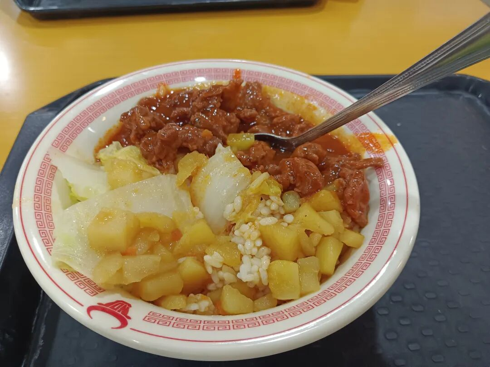

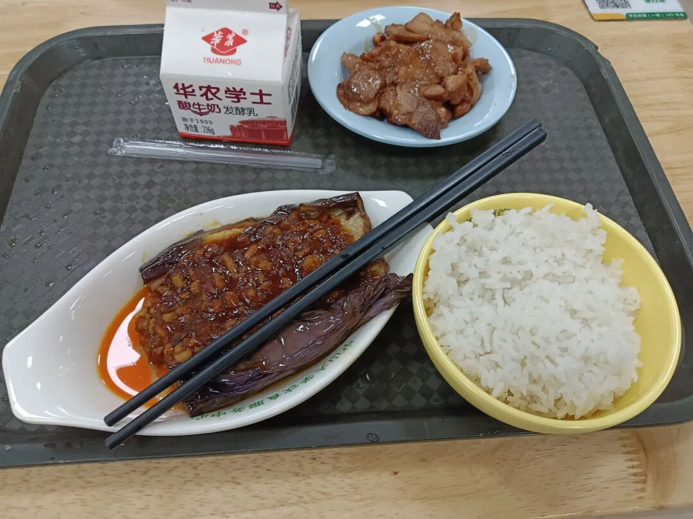

这要感谢一位在中山大学读书的朋友。因为他，我得以进入中大校园，在食堂吃饭，逛校史馆和校园里的地标建筑，也喝上了华农的酸奶。朋友上水课的时候，我还跑进教室给他送了一杯咖啡。现在回想起来，这件事依然让我觉得很新奇：原来我也会出现在别人的大学课堂门口，给正在上课的朋友送咖啡。

我承认自己多少有点“名校情结”。去广州以前，我就很想逛一逛985大学的校园，看看里面是什么样子，也亲自感受一下所谓的名校氛围和环境。

9月1日下午和9月2日中午，我在中大校园里骑了两次车。

其中一次，朋友去上课了，我一个人在校园里漫无目的地骑行。路上没有什么一定要完成的任务，也没有必须赶到的景点。我经过草坪、古树和砖红色的建筑，看见有人骑车，有人走路，偶尔还会遇到几只中大的“猫学长”。

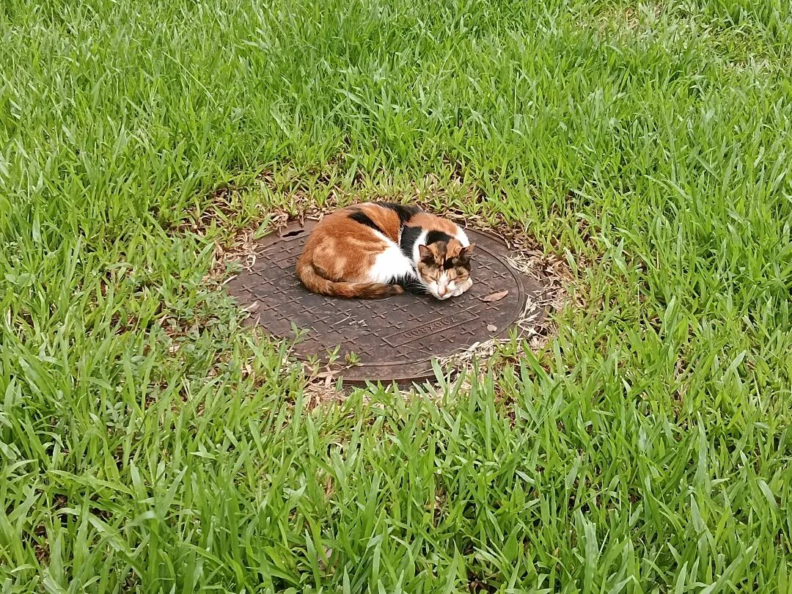

中大的美并不张扬。那些建筑和古树安静地待在那里，骑车和走路的人自然地穿过校园。风迎面吹过来的时候，我没有特别明确地要去哪里，只觉得自由、舒服，好像自己也逐渐融进了这片校园。

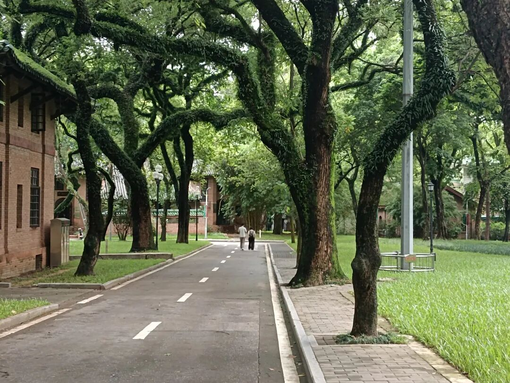

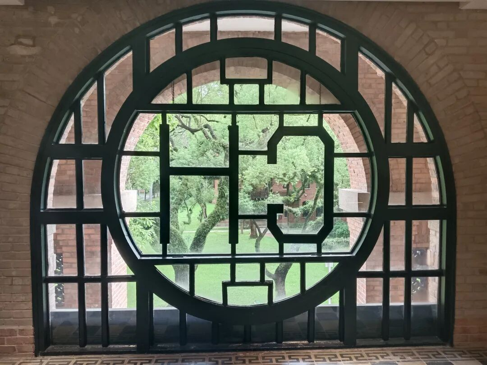

绿树成荫的道路、带着历史感的建筑，以及在校园里骑车这件事，都很符合我过去对大学校园的想象。那两个下午，我没有急着去完成什么，只是在校园里走走停停，感受百年中大的环境和氛围。

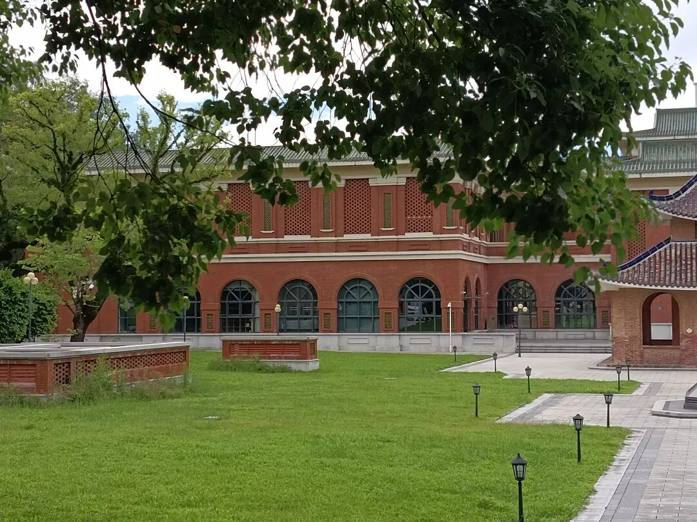

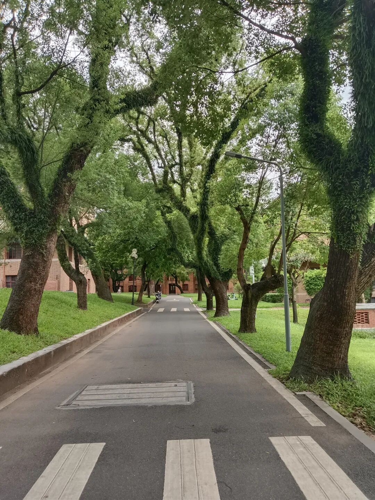

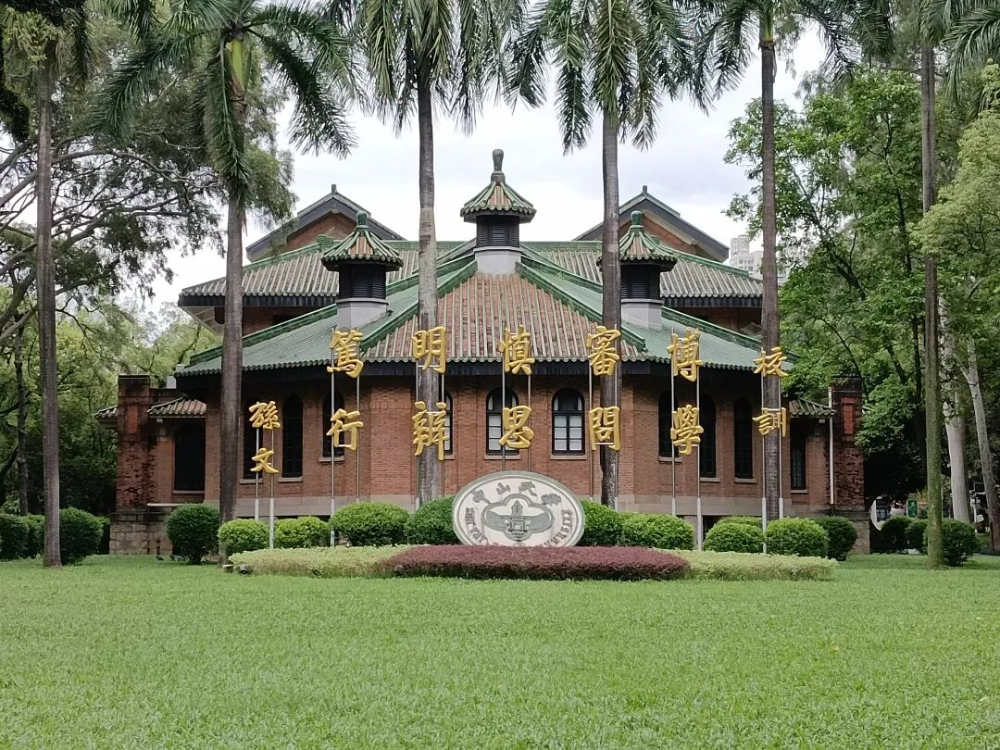

当然，我知道自己只是一个短暂停留的游客。旅行中的我看到的，更多是校园安静、漂亮和轻松的一面，并不是中大学生完整的日常生活。但对我来说，能够真正走进一所过去只在网络和学校名称中了解的大学，在里面吃饭、骑车、逛校园，本身就已经是一段很新奇的体验。

这次中大之行没有给我带来什么必须上升为大道理的结论。它只是满足了我逛一逛985校园的小愿望，也让我留下了几段很具体的记忆：食堂里的饭、朋友的咖啡、路边的猫，还有骑车穿过古树和红砖建筑时吹来的风。

## 晚上十一点，我第一次住进青旅

9月1日晚上十一点左右，我从昌岗地铁站出来，打开手机地图，准备骑车去找预订好的青旅。

当时街上的车和人都不多。一个人在广州的夜晚骑车，本来还挺惬意的——如果不是已经十一点多，而且我的路痴属性又开始发作的话。

原本只有几分钟的路程，我却跟着导航绕来绕去，最后骑进了一个只有几盏路灯的居民区。便利店门口，几个中年大叔围在一起打牌；路上只有我一个人在骑车。地图上的路线还在继续往前延伸，像是要把我带进一条偏僻、黑漆漆的小巷。

我越骑越觉得不对劲，立即掉头，按原路返回，重新导航。

一个人在深夜的陌生街头，说不害怕是不可能的。我给好朋友打了视频电话，让她“云陪”我走完这段夜路。好在重新导航以后，没过多久我就找到了青旅。

这是我第一次住青旅，而且是一家全女青旅。

办好入住后，前台小姐姐带我上楼，很温柔地告诉我床位、柜子和各个区域分别在哪里。青旅还准备了耳塞、蒸汽眼罩、一次性杯子、牙刷牙膏和一包一次性毛巾。

青旅被分成动、静两个区域。静区主要是住宿的房间；动区里有桌子、冰箱、小沙发、鞋柜和行李柜，再往里走，就是洗澡、洗漱、吹头发、洗衣服和晾衣服的地方。

虽然已经很晚了，动区里还是有不少住客。有人在办公，有人在追剧，有人在刷短视频，也有人低头翻找自己的东西。大家明明互不认识，却都默契地保持安静，各自做着自己的事。

**更重要的是，这是一家全女青旅。**深夜身处陌生城市，身边的住客都是女性，这件事本身就给了我很大的安全感。虽然大家没有交流，甚至不知道彼此的名字，但看见她们安静地待在同一个空间里，我像是在陌生环境中找到了同类，心里也慢慢放松下来。

这家青旅还有一些很加分的细节。淋浴间门后贴着安全提示，如果遭遇偷拍，可以拨打附近派出所的电话；如果住客碰上生理期，也可以到前台领取卫生巾和一次性姨妈垫。住宿区域同样贴有紧急情况的求助说明和联系电话。

这些细小的提醒并不能消除所有风险，却让我感觉到，这家青旅认真考虑过女性独自出行时可能遇到的处境和需要。

洗漱完毕，我带着满身疲惫躺进小小的床里。枕头和床都是软乎乎的，那一刻，我突然觉得很安心，也很幸福。

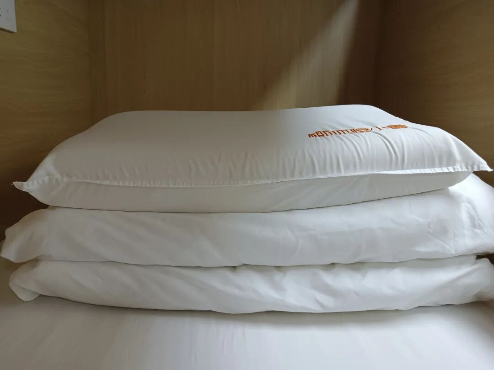

**偌大的世界，有一张小小的床供我睡觉、安身。**

这大概就是课本里所说的“审容膝之易安”吧。

## 广州的早晨：一位老奶奶、一份肠粉和街巷里的城市气息

9月2日早上，我在昌岗地铁站附近随便找了一家早餐店，点了一份12元的拉布肠粉。

看到价格的时候，我的第一反应是：有点贵。毕竟在玉林，一份有肉有蛋的肠粉，大概也就五六块钱。

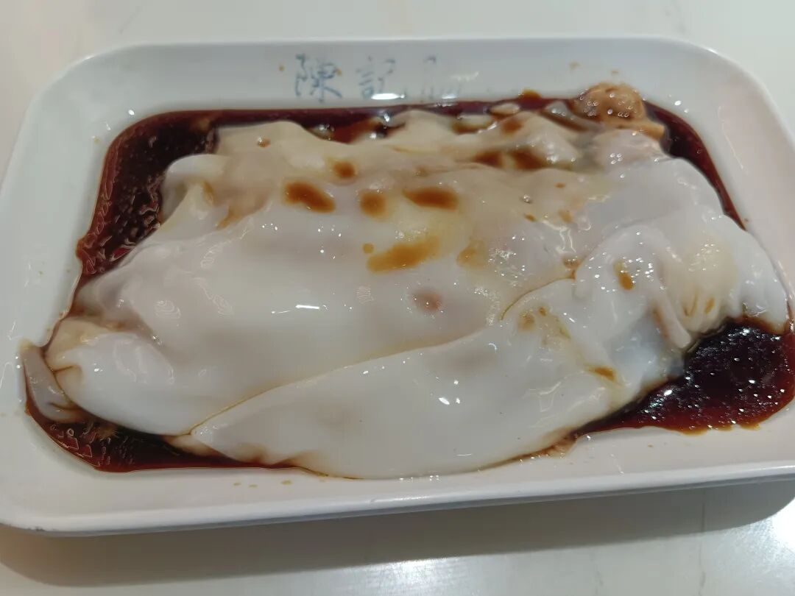

不过，广州的这份肠粉和我平时吃到的不太一样。里面的肉馅很像云吞肉，QQ弹弹的；肠粉本身也很滑，味道偏咸。就我个人的体验来说，这一份确实有点贵。当然，我对广州整体的物价并不了解——两天里吃了四顿，有三顿都在中大食堂，所以这只能算是一名外地游客对一顿早餐的主观感受。

吃完早餐，我从青旅出发，沿着附近的街巷往前走。这时我才发现，自己昨晚在黑暗中绕过的地方，原来是陈复红色文化街区。

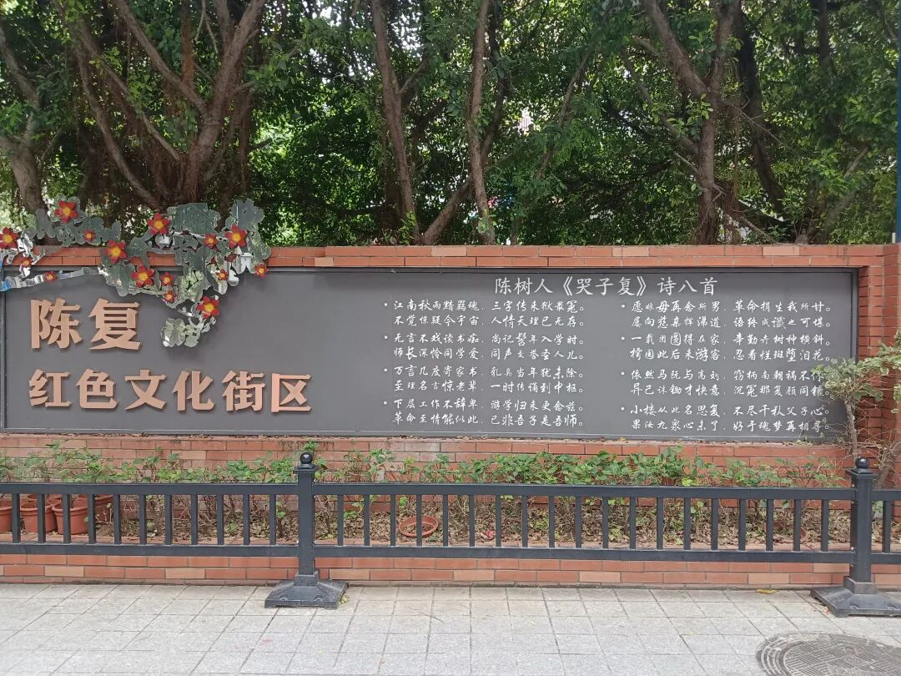

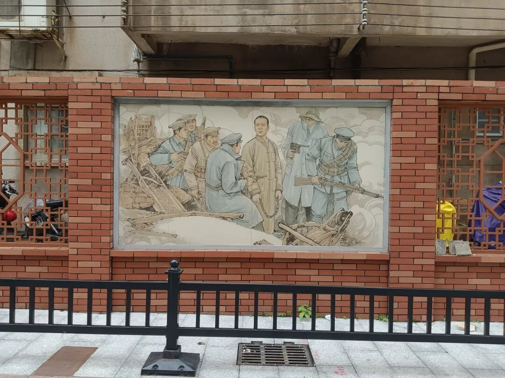

街区的红墙上画着革命主题的宣传画，也出现了木棉花的元素。木棉花又被称为“英雄花”，放在这样的街区里，和周围的红色文化氛围很相衬。

走进昌岗地铁站时，我又注意到一个很小的细节：扶梯一路上的广告几乎都是公益宣传，画面和色调都比较简洁、素雅。相比之下，我在其他一些地铁站看到的广告，更多是颜色鲜亮、很抢眼的商业宣传。

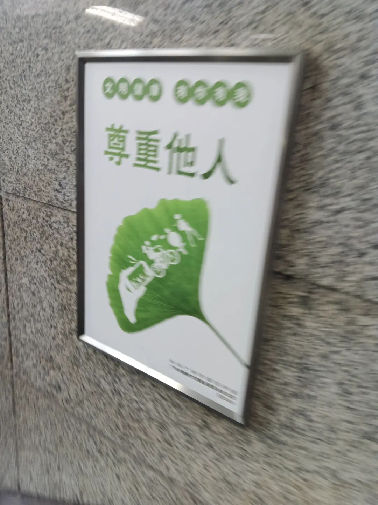

这些未必是什么必须专程打卡的景点，却构成了我对广州日常生活的一部分印象。

随后，我来到了中山纪念堂。

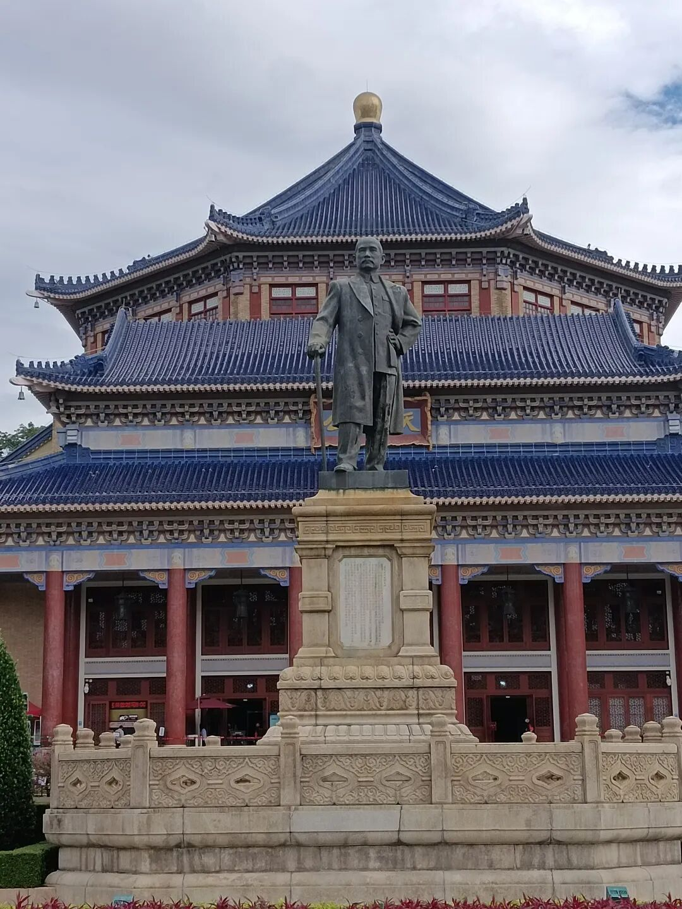

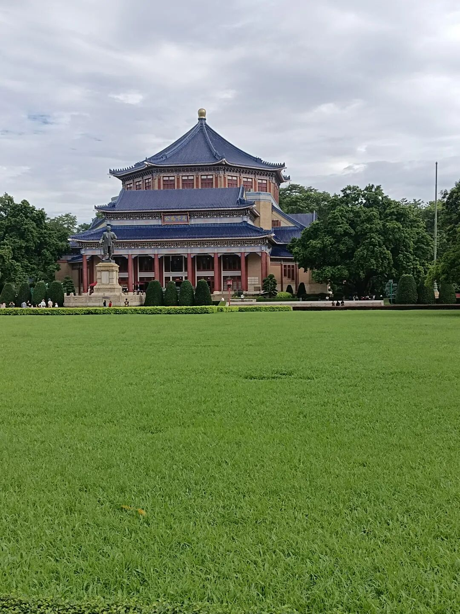

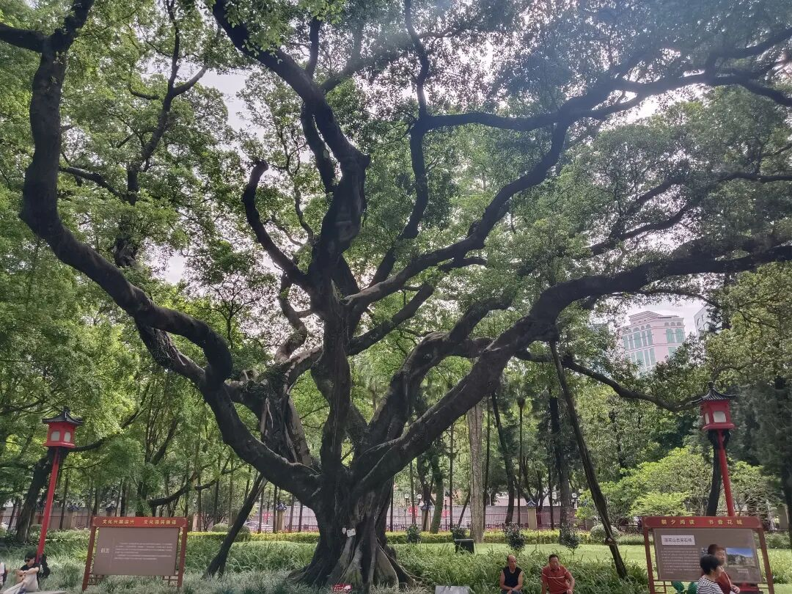

很幸运，那天天气晴朗，而且正好还能看见孙中山先生的雕像。听一位老奶奶说，雕像从第二天开始就要进行维修。

我和这位奶奶原本并不认识，却在纪念堂里聊了起来。她和我分享了一些自己的人生经历，也很认真地给了我许多建议：大学四年要好好学习、积累经验，最好再多学一门语言；面对长辈的教导，可以多听、多问；不要太早把人生重心放到恋爱和结婚上，还是要先提升自己。

聊天结束后，我们互相加了微信。晚上，她又发消息邀请我去她家做客。可惜那时我已经回到了东莞。

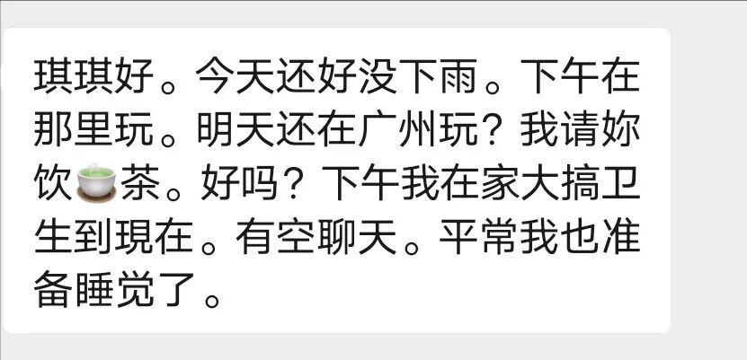

**我们明明只有一面之缘。收到消息的时候，我既意外，又有一点感动。**

回想这几天的旅行，真正让我留恋的，未必是多热门的景点、多好吃的食物，也不是什么非去不可的消费体验。更多时候，是我在一个陌生地方与人产生的那些短暂而真实的连接。

当然，广州给我留下的印象并不只有人与人的相遇。

在广州的两天里，我感受到这里既有街巷和早餐店带来的烟火气，也有比较便利的交通和完善的基础设施。**广州是一座令我向往的城市。**

## 离开广州前，我弄丢了一只羽毛球拍

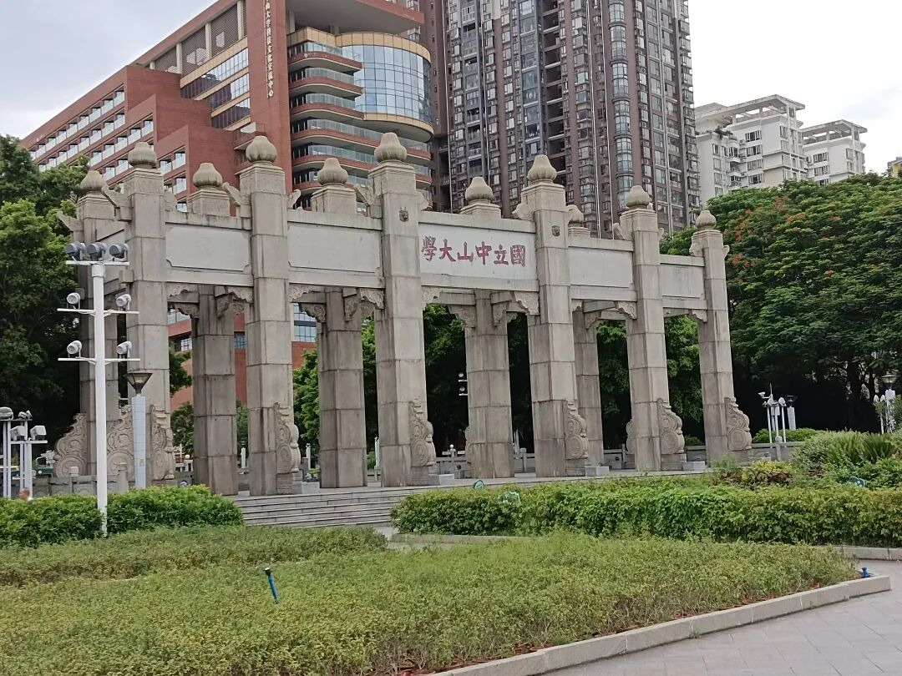

9月2日下午两点多，我从中大北校门出来，在珠江边和朋友分别。

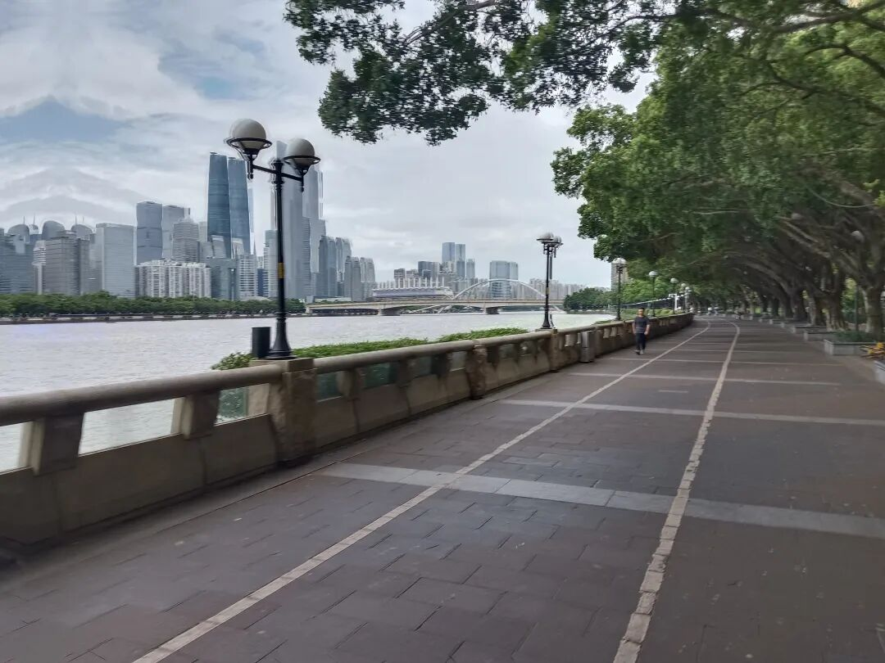

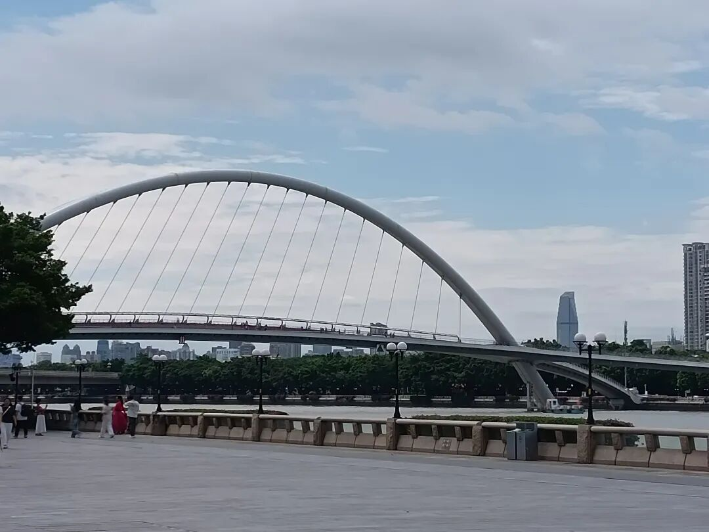

离开广州的动车是下午五点。时间还早，我便一个人沿着珠江骑车。风从江面吹过来，路上有不少老人在散步。看着眼前的景象，我莫名想起了曾点所说的：“莫春者，春服既成，童子六七人，浴乎沂，风乎舞雩，咏而归。”

骑车的时候，我已经知道，几个小时以后，自己就要离开这座城市了。

没想到，真正让我在返程路上焦急起来的，不是舍不得广州，而是我把一只羽毛球拍落在了广州东站的候车区。

等我意识到球拍不见时，人已经到了广州新塘站。城际动车还在继续向前开，我不可能再原路返回，只能隔着手机想办法。

这只球拍对我有很重要的意义，所以发现它不见以后，我心里咯噔一下。在焦急中，我先打开AI软件查询车站失物应该怎么处理，然后拨打站点电话说明情况，同时在铁路12306里提交了遗失物品登记。

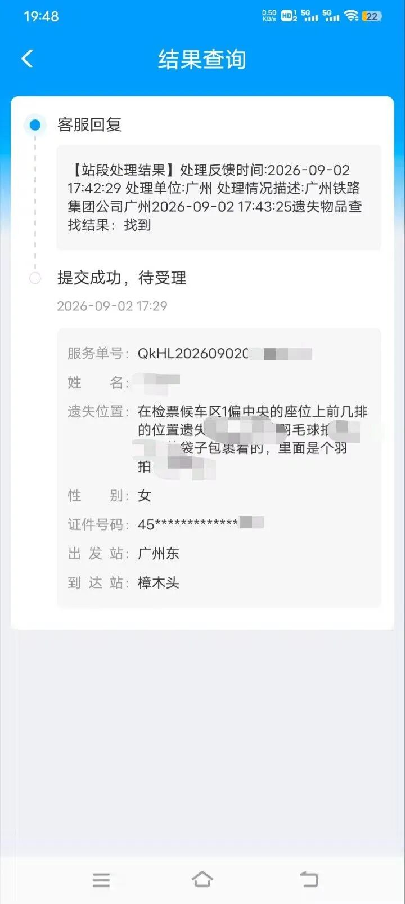

登记时，需要讲清楚物品是在车站还是列车上遗失的、丢失了什么，以及最后一次见到它的大致位置。

幸运的是，广州东站的工作人员接到电话后帮我进行了寻找，最后真的找到了那只羽毛球拍。

接下来，我可以选择回车站领取，或者办理邮寄。因为人已经离开广州，我选择了邮寄，也第一次体验了线上给自己寄快递。

直到确认球拍被找到，我悬着的心才放了下来。

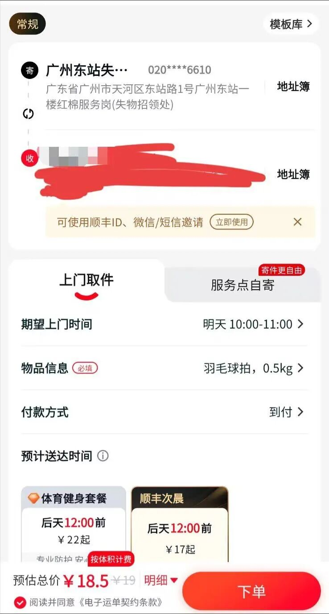

其实在最着急的时候，我已经想过：如果真的找不回来，那就找朋友哭一顿，再去吃一顿好的。好在最后不用哭了。失而复得，大概也算是旅途中一种意外的幸运。

这段小插曲，也成了我离开广州前的最后一段记忆。我要感谢广州东站的工作人员。正是他们耐心的帮助，让这只对我意义重大的羽毛球拍，最后又回到了我的手里。

## 我还会再来广州

这两天里，我没有做一份严密的攻略，也没有完成一张标准的景点清单。

我在中大校园里漫无目的地骑车；深夜迷路时，给朋友打视频电话；第一次住进全女青旅，在一群陌生女性中感到安心；吃了一份对我来说有点贵的肠粉；在中山纪念堂遇见一位热情的老奶奶；离开广州时，又经历了一次羽毛球拍失而复得的小插曲。

现在回想起来，这些事情有的很小，有的甚至不在原来的计划之中，却共同组成了我对广州的记忆。

我喜欢这座城市的烟火气，也喜欢它便利的交通、丰富的资源和深厚的人文历史。两天的时间不足以让我真正了解广州，但已经足够让我对它产生向往。

**我不知道下一次会在什么时候到来，但我心里隐隐觉得：以后，我还会来很多次广州。**

希望下一次再来时，我已经学有所成，兜里也多了一点钱。如果可以的话，我还想带妹妹一起来看看，让她在填报志愿以前，亲自感受一下网络之外的一线城市：这里的交通、环境、资源、人文历史，以及人们真实生活的节奏。

而属于我的上海大学生活，也才刚刚开始。
