9月3日，早上九点多到深圳北站，傍晚五点多又坐车回了东莞南。

这是我第一次去深圳。一天里，我去了博物馆、工业展览馆、书城、公园和美术馆，地方不少，但也没给自己安排多严密的路线。许多时候，只是走到附近，觉得“来都来了”，就进去看一看。

刚到深圳时，我被车站和高楼的规模震惊到了。到了下午，最让我舍不得离开的，却是原本为了找厕所才走进去的关山月美术馆。

不过，先说说那天的地铁。

## 在早高峰里认识深圳

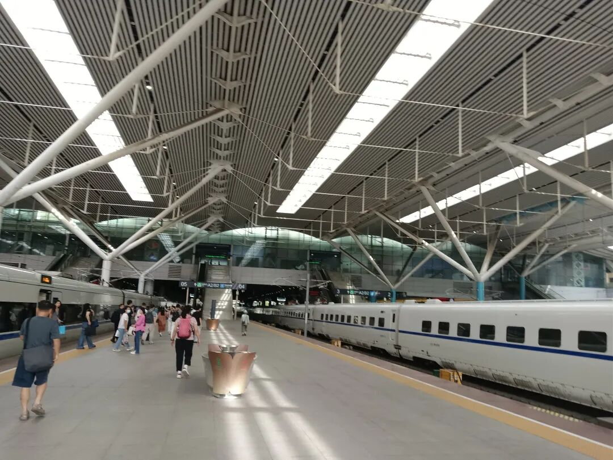

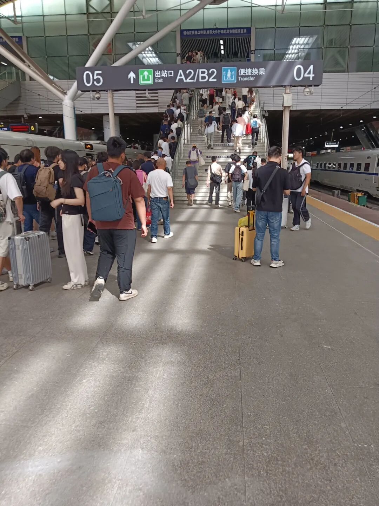

刚出深圳北站，我的第一反应就是：好大。

周围的人都在匆匆赶路，没一会儿，出站口的扶梯和楼梯上就挤满了人。出了车站，眼前是高大的楼宇，还有几处地铁站出入口。我跟着人群走进地铁站，大家刷码、过闸机，脚步都很快。

站里还有一种像计时器打点一样的声音。我没弄清楚是从哪里传来的，只觉得它也在催人往前走。

地铁还没到站，我就透过玻璃看见了车厢里乌泱泱的人头。车门打开，零星几个人下来，更多的人又往里挤。我也顺势挤了上去。

**新闻里总说“早高峰挤地铁”，以前只是听说。这一天，“挤”字终于有了具体的感觉。**

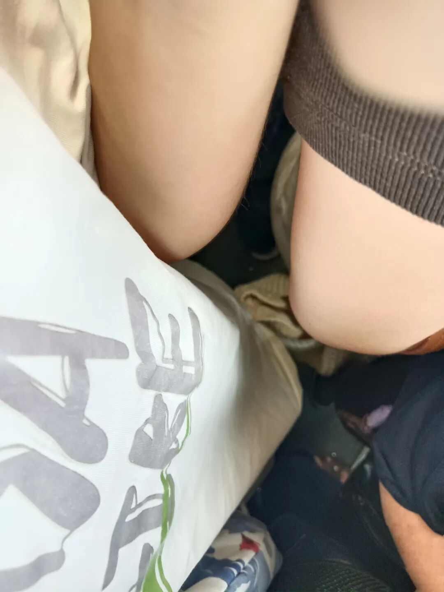

车厢里，穿皮鞋的、穿高跟鞋的、穿拖鞋和运动鞋的，都挤在一起。有人穿着体面的制服，有人穿着松垮的短袖；有人背双肩包，有人拎小包，还有人拖着行李箱。年轻人和头发花白的人，都在同一辆地铁上。

大多数人一只手抓着能维持平衡的东西，另一只手拿着手机。有人飞快地打字，有人刷短视频，也有人看小说。

我被挤在中间，夹缝求生，双手环在胸前，扯着单肩包的肩带护住自己。位置也很尴尬：靠不到车门，又够不着扶杆。

地铁到站刹车，我被惯性带得往后退了一下。周围早就水泄不通，混乱中，我好像不小心踩到了旁边大哥的脚。

低头一看，他穿的是拖鞋……

## 高楼之间，兜兜转转找博物馆

这趟地铁是4号线，我在市民中心站下了车。

出了地铁站，又一次被眼前的高楼震惊到了。蓝色、冷色调的楼宇，高得让我忍不住抬头看。在玉林，我很少见到这样的景象。

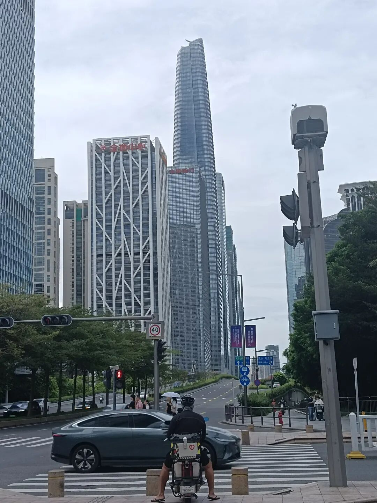

这些楼看起来有一点冰冷。街道却很干净，往来的车辆也有序，一切像一台精密的仪器，在高效地运作着。

我打开导航，准备走去深圳博物馆。走着走着，手机又响起了熟悉的提示：

“您已偏航，已为您重新规划路线。请沿当前道路继续直行。”

我的方向感向来不太好，跟着导航也会走错，对此已经习以为常。问了两位路人，再继续跟着手机绕，终于兜兜转转找到了博物馆。

过了安检，我看见旁边写着一句话：**“来了就是深圳人。”**

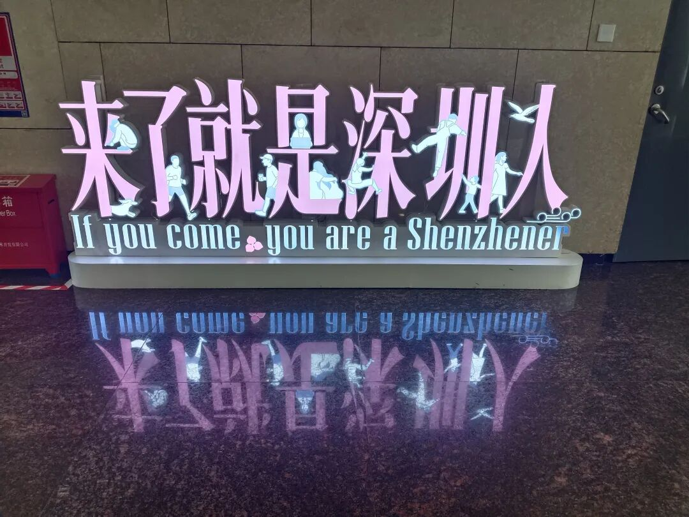

以前在学校读《深圳青年》杂志时，我就经常见到这句话。那时候，只觉得它是一句城市宣传语。如今真的来到深圳，在博物馆里又看见它，感觉就不太一样了。

我还只是一个刚到这里的游客，却也觉得这句话有一点亲切。

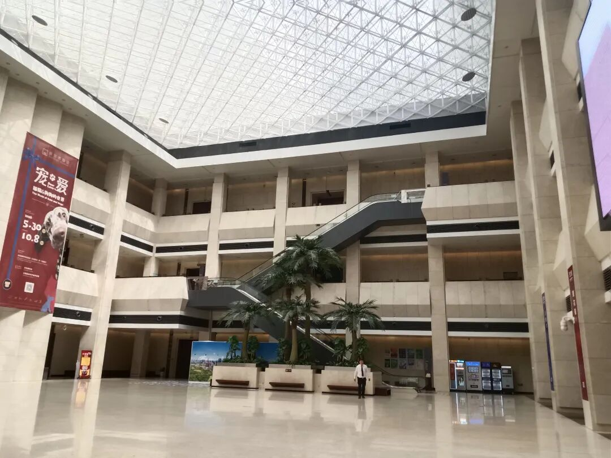

博物馆里，我逛了介绍古代深圳、近代深圳和民俗文化的几个展厅。不过说实话，这一段我看得比较走马观花，现在回想，具体的展品已经记不太清了，倒是馆里开得很足的冷气让我印象深刻。

逛展的时候，手机又弹出一条南方电网发来的短信：欢迎来到深圳。

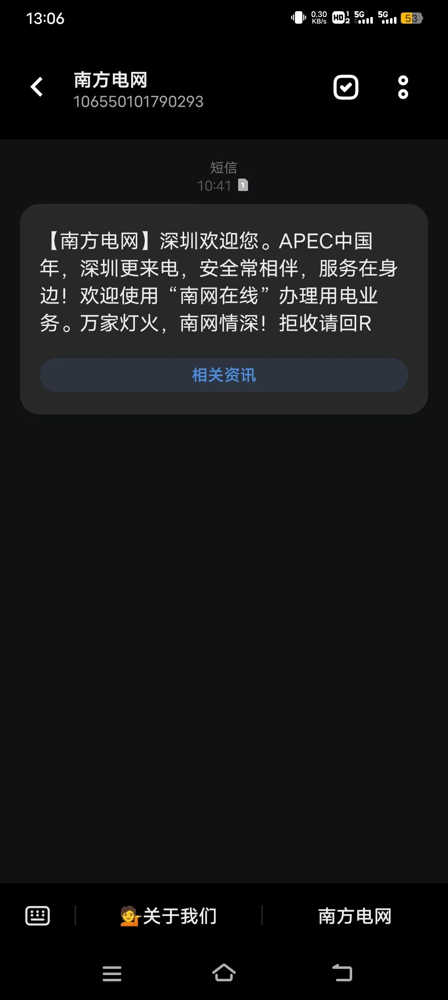

一天里，深圳以这样的方式，跟我打了两次招呼。

## 机器人做饮品，我误打误撞进了书城

从深圳博物馆出来，我还没想好下一站去哪，就在附近随便逛了逛。走到一处政务服务中心附近，看见指示牌上写着工业展览馆，便想着：来都来了，上去看看。

还没进展厅，存包的柜子先让我觉得新鲜。它用的是人脸识别，不用拿着一张小纸条，也不用担心把凭条弄丢。

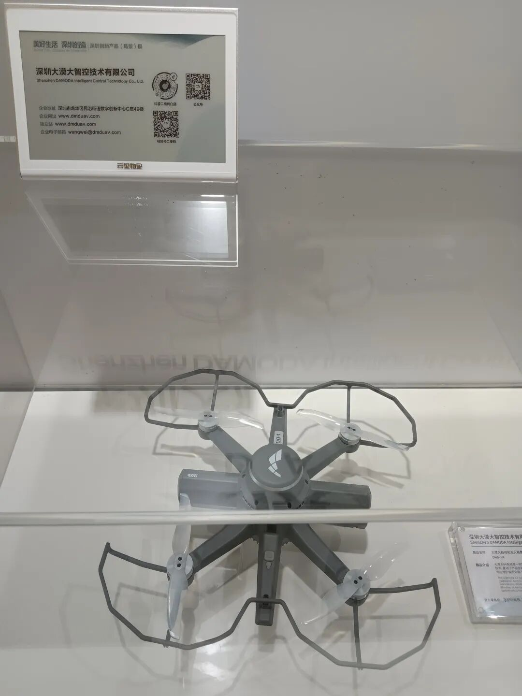

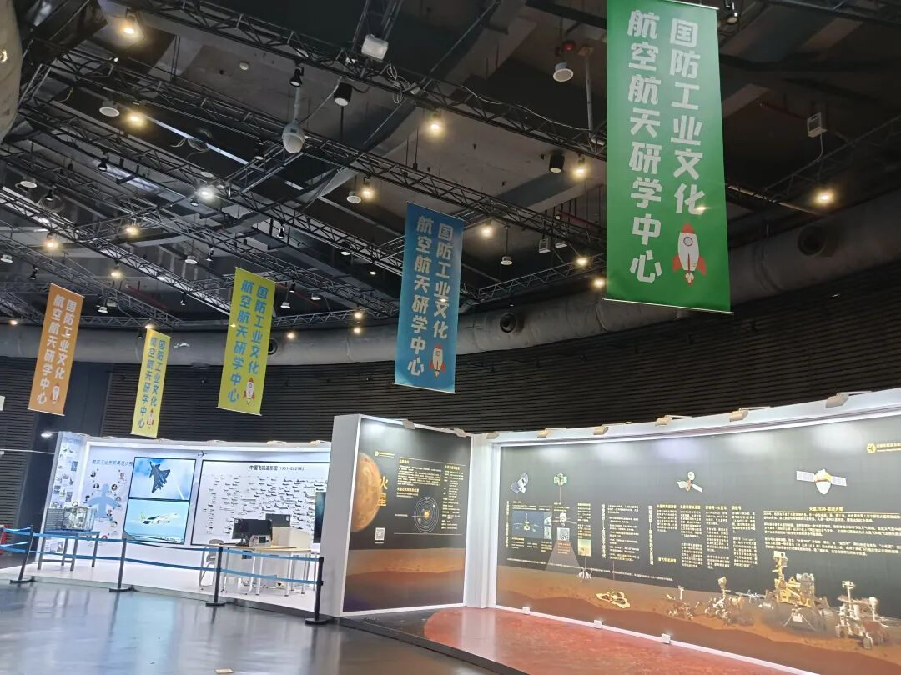

展厅里有翻译眼镜、测试体态的机器、机械臂、投影仪、智能家居等产品。原谅我贫瘠的语言和知识，有些东西我看了半天，也说不清究竟该怎么介绍。

这些产品在玉林很少见到。以前在课本里读到“满足消费者个性化、定制化需求”，总觉得有些抽象。现在看见眼前这些针对不同需求设计的产品，才稍微有了一点具体的认识。

出了展厅，旁边竟然还有机器人制作冰淇淋和饮品。

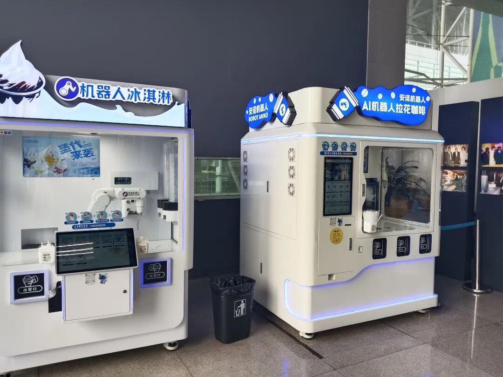

这类东西我以前只在新闻里见过，既然碰上了，就想体验一下。我扫码点了一杯茉莉拿铁，站在那里，看机械臂一步一步地制作。

我原以为它会动作很快，没想到它按照程序慢悠悠地忙活，甚至有一点像颤颤巍巍的老人拄着拐杖走路。

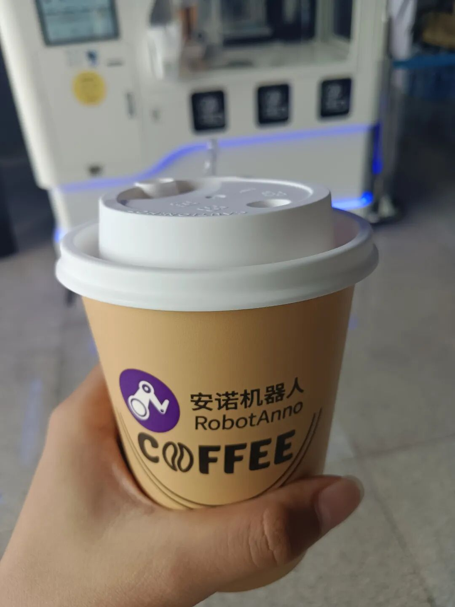

终于拿到那杯由机器人制作的茉莉拿铁。尝了一口，我只能说：**中规中矩，有待提高。**

从工业展览馆出来，我又有点弄不清自己在哪了，只觉得站在一个类似天桥的地方。找了张路旁的椅子坐下，喝着那杯拿铁，给朋友发发消息，歇一歇。

休息过后，我继续往前走，遇见楼梯就顺势下去。下面有一家装修得很现代的餐厅。我推门往里走，误打误撞，竟然来到了深圳书城的中心城店。

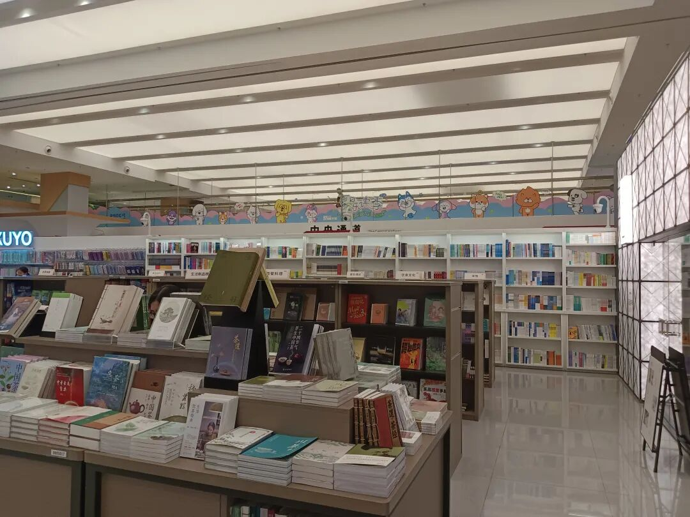

里面有不少书店，书籍摆放得整整齐齐，种类也多。有些人在看书，有些人在学习。我慢慢地往里逛，看见店里的摆设竟然还有奶龙，觉得它们也挺懂年轻人。

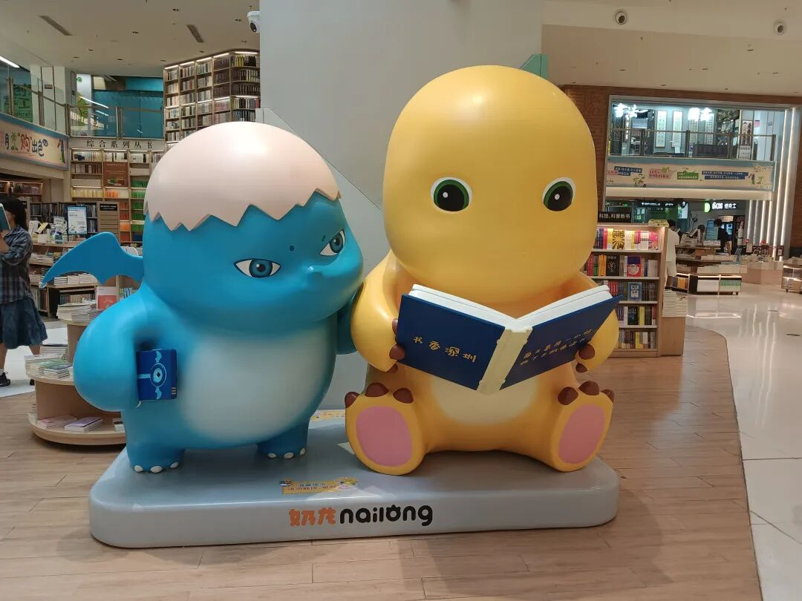

还有一些店，虽然叫文具店，卖的却不只是笔和本子，也有饰品、玩偶、二次元周边和“谷子”。暖黄色的灯光照着这些小东西，看起来很有质感，让人莫名觉得舒服、安心。

走到另一家书店入口，我又看见了那句熟悉的话：

“来了就是深圳人。”

它被放在正中央，很显眼。从博物馆走到书城，这句话又和我碰了一次面。

## 为了找厕所，我走进了关山月美术馆

离开深圳书城，看见路标上写着莲花山公园，我便打算过去逛一逛。

说起来，我对这个公园的印象，竟然是从厕所开始的。

以前刷视频时，有位博主夸过这里的厕所：女厕的坑位比男厕多，空间也更大，还很干净。平时在公共场所，总能看见女厕门口排着长队，所以当时就记住了这个地方，想着有机会也去看看。

不过，在去看厕所之前，我得先找到公园。

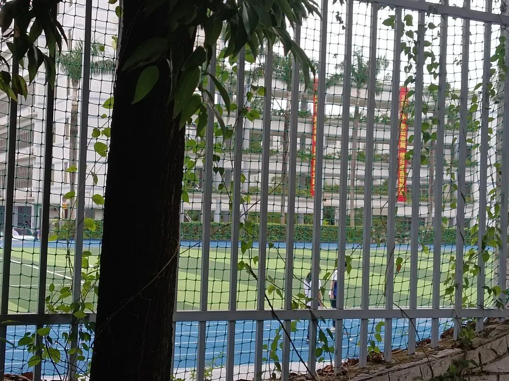

我又打开导航，绕着莲花村居民区和莲花中学走了一大圈。路过中学时，隔着铁栅栏往里看，栏杆上爬着青翠的藤蔓，教学楼的连廊上也种着绿植，很有青春校园的感觉。虽然又走了弯路，沿途倒也有些东西可以看。

终于找到莲花山公园，草坪绿油油的，修剪得很好，树也长得茂密，适合在下面纳凉。

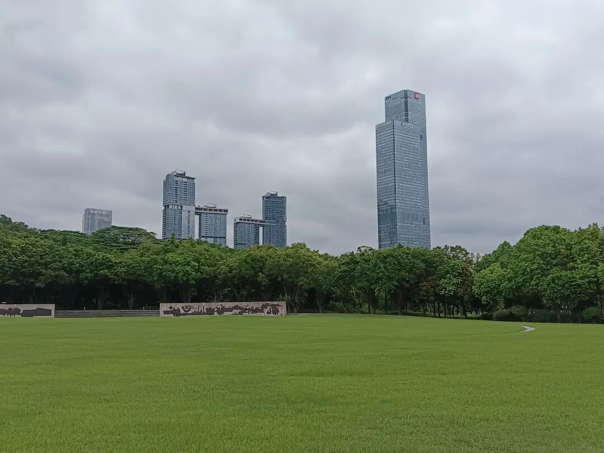

走了一会儿，我想找找之前视频里说的厕所。打开地图，却发现离我最近的是关山月美术馆的厕所。本着就近原则，我就往美术馆走了。

没想到，这一趟最让我舍不得离开的地方，竟然是这样找到的。

### 有人讲解以后，画才慢慢看进去了

既然来了，我便顺便看看展览。

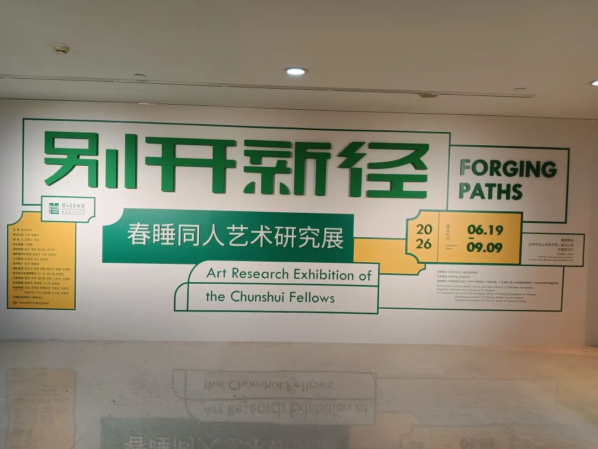

先上二楼，看了《春睡同人艺术研究展》。展览讲到高剑雄和他的朋友、学生，以及他们在不同时期的创作：有对绘画技法的探索，也有战争年代对民众处境的关注，还有后来对劳动与生活的描绘。

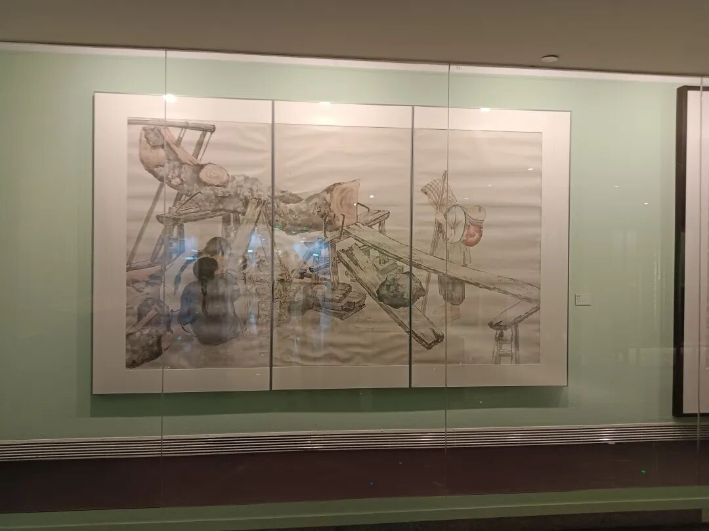

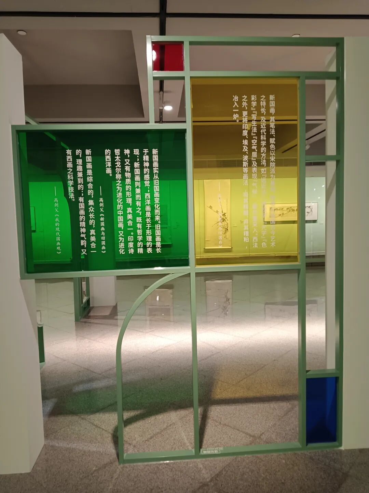

一开始，我看得很走马观花。我不懂技法，只能从画里的景物、人物中猜一猜，再看看年份和标题，试着想象画家当时是在什么背景、什么心境下画出来的。

但即使这样，我还是觉得自己和画之间隔着一段距离。

幸运的是，我遇上了馆里的公益讲解。工作人员把几位游客聚到一起，细细地讲画里的技法、创作背景，还有画家与朋友、学生之间的情谊。

她讲得很温柔。听着听着，我也会抬头和她对视，继续跟着她的讲解看画。

在她娓娓道来的讲解中，我开始理解画家身上的文人风骨，也试着去感受他们所处的那个风雨飘摇的年代。原本只能大概猜测的地方，慢慢有了具体的来由；画家对生活的细致观察和旨趣，也变得更容易体会了。

**同样一幅画，有人讲解以后，我才慢慢看进去了。**

我才意识到，看一幅画需要了解很多东西。只靠自己走马观花，可能很难看明白；知道一点时代背景和创作者的经历，再回头看，感受确实会不一样。

### 《盛世灯火》：一种震撼到失语的感觉

后来，我又上了三楼，看了一位姓颜的艺术家的展览。

具体名字我没有记牢，但看过他的作品以后，那种震撼却深深地留在了心里。

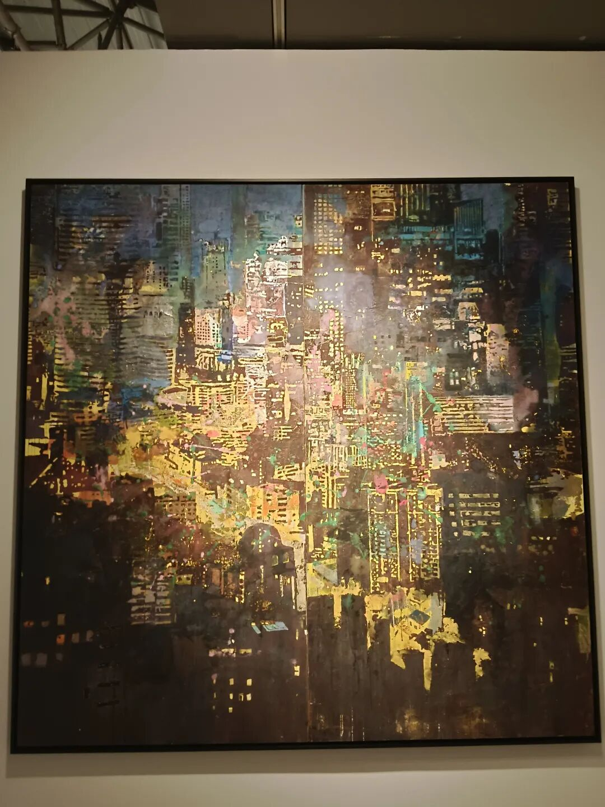

我尤其喜欢其中一幅《盛世灯火》。从画里，我能感受到繁荣，也能感受到烟火人间的气息。

我不怎么懂技法，但那些鲜活的画面、纹路和凸起，就这样呈现在眼前，给我一种灵魂震颤的感觉。

**那种艺术的冲击力，竟然让我一时失语。**

这是我以前看画展时没有过的感受。我说不清它究竟好在哪里，却知道它实实在在地打动了我，在心里留下了很深的印记。

后来，我又到一楼看展。那些作品鲜活地摆在那里，静静地等人去欣赏。我一件一件地看，还是很难形容那天下午的感觉，就像整个人经历了一番熏陶和洗涤。

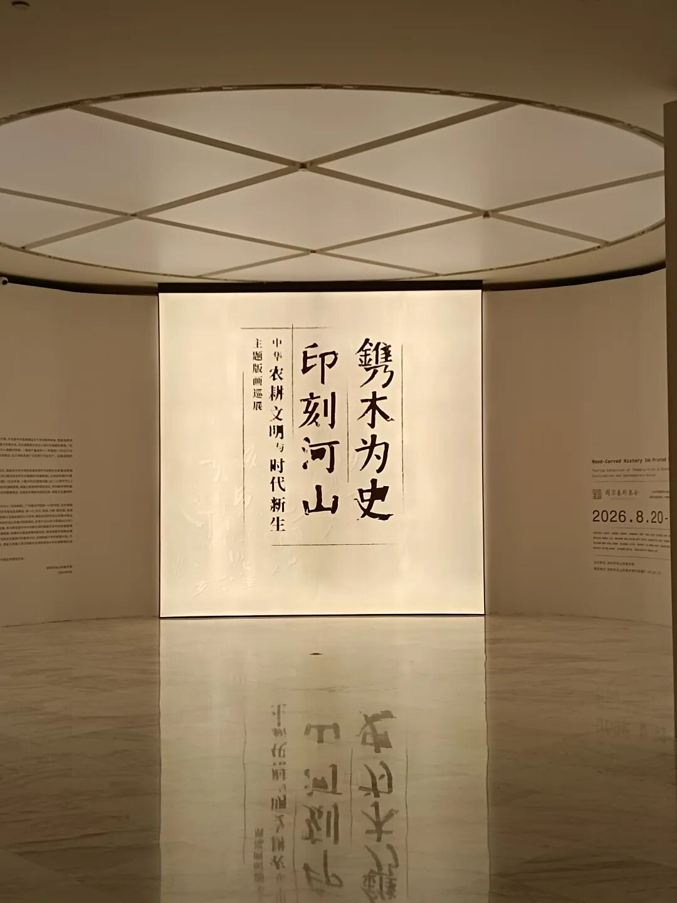

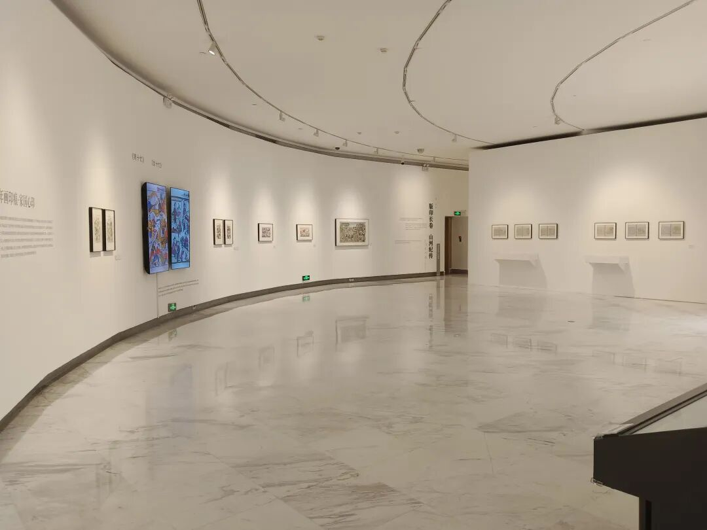

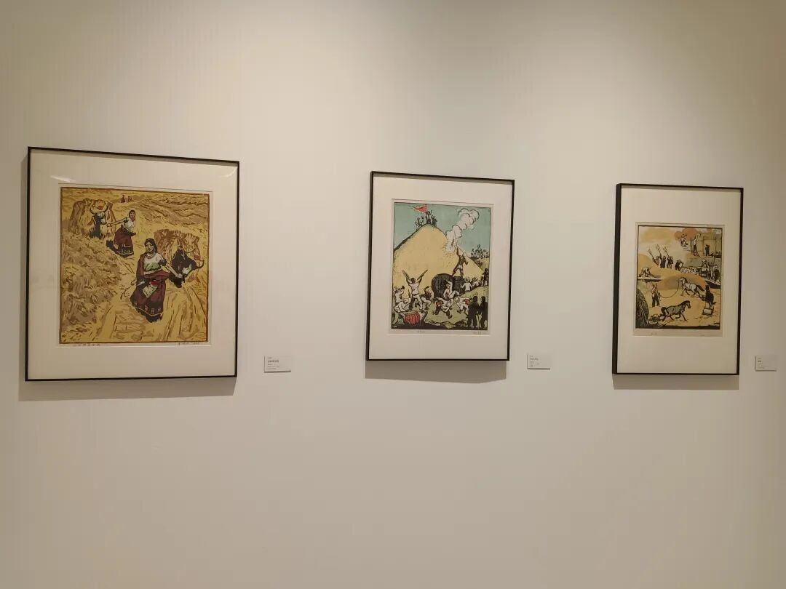

直到快五点，馆里准备闭馆了，我才依依不舍地离开。

最初只是来找个厕所，最后却看展看到了闭馆。

## 在少年宫门前，结束这一天

离开美术馆后，我又跟着导航，往附近的深圳少年宫走，想看看传说中的少年宫是什么样子。

到了建筑前，里面已经响起了准备闭馆的音乐。看来还是晚了一点，我也没再进去，就在外面拍了张照片。

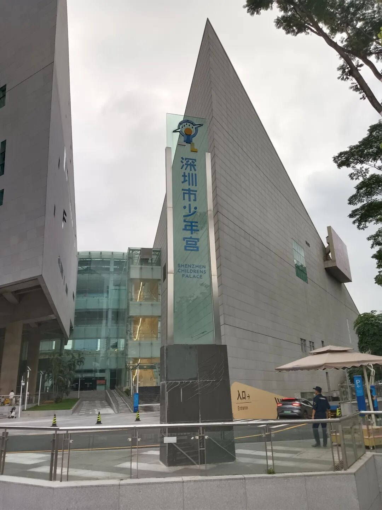

以前刷视频时，看到过类似的说法：小明从家到少年宫只要10分钟，而我用了很多年。那些视频是在感慨教育资源的差异。

但18岁的我真正站在少年宫前，心里却没有多大波澜。没有像视频里那样感慨万千，只是在门前看了看，拍了照，然后准备离开。

眼看时间不早，我搭地铁回深圳北站。

走进候车区，又被它的规模震惊了一次：好大，好明亮，人也好多。不过这次顾不上慢慢看了，为了不耽误检票，我还跑了一段路。

早上挤地铁，傍晚赶动车，中间却在美术馆里待到了闭馆。

这一天，我在深圳绕了不少路，也误打误撞走进了几个地方。博物馆的展品没记住多少，机器人做的拿铁味道一般，少年宫也没能进去。不过，关山月美术馆里的讲解和那些画，至今想起来，还是觉得这一趟没有白来。

我的第一次深圳之旅，就这样结束了。
